# 20260831 standalone 全实验数据（工作版）

> 本文是自动生成的数据工作报告，不是最终提交版。主长测采用 20k warmup + 100k measurement；除特别标注外均使用文档中的 B=32 标准 routing。

## 完成范围

已聚合 9384 个样本；包含 section：`cross, escape, escape_deadlock_contrast, escape_off, information_ablation, main, random_distribution, routing_ablation, scaling`；命令失败 0 个。

## 0. 静态数据

| Topology | links | wire | length_mean | length_min | length_max | horizontal | vertical | diagonal | ASPL | diameter | efficiency | cut_v | cut_h | top8_express_mean |
|---|---|---|---|---|---|---|---|---|---|---|---|---|---|---|
| Mesh | 0.0000 | 0.0000 | 0.0000 | 0.0000 | 0.0000 | 0.0000 | 0.0000 | 0.0000 | 5.3333 | 14.0000 | 0.2673 | 8.0000 | 8.0000 | 0.0000 |
| Uniform ASPL Greedy | 8.0000 | 31.0000 | 3.8750 | 3.0000 | 4.0000 | 4.0000 | 4.0000 | 0.0000 | 3.8368 | 8.0000 | 0.3230 | 12.0000 | 12.0000 | 1.3248 |
| Uniform SA | 6.0000 | 32.0000 | 5.3333 | 4.0000 | 8.0000 | 1.0000 | 1.0000 | 4.0000 | 4.0694 | 9.0000 | 0.3111 | 12.0000 | 13.0000 | 1.2125 |
| Random mean | 5.6000 | 32.0000 | 5.9257 | 3.7000 | 8.6500 | 0.4000 | 0.5000 | 4.7000 | 4.2860 | 9.7500 | 0.3021 | 11.0000 | 10.9500 | 1.2520 |

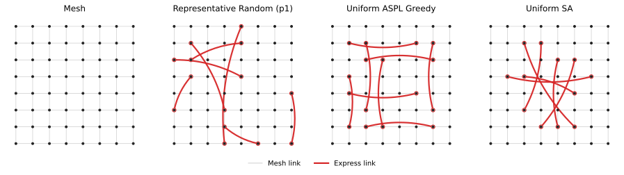

其中 cut_v/cut_h 是穿过中央纵/横二分面的物理双向边容量（表中按物理边计数）；top8_express_mean 是所有 source-destination 候选路径中的平均 express 条数。

## 1. 主实验

下列三张表每格均为 `accepted throughput / packet latency`，latency 按 cycle 四舍五入到整数。

主曲线保留原始 rate=0.05--0.80、步长 0.05 的全范围扫描，并在饱和附近补充 0.01 粒度：Bit-complement 为 0.26--0.52，Tornado 与 CutStress-bidir 为 0.36--0.80。throughput--latency 图中彩色实线是各 topology 自身的 Pareto frontier；被同一 topology 另一工作点同时以更高吞吐和更低延迟支配的过载点仍保留为灰色空心点。

### Injection rate = 0.4

| Traffic | Mesh | Random expectation | Greedy | SA |
|---|---|---|---|---|
| Uniform | 0.1998 / 17 | 0.1999 / 25 | 0.1998 / 15 | 0.1998 / 15 |
| Tornado | 0.1998 / 74 | 0.1996 / 132 | 0.1999 / 12 | 0.1999 / 11 |
| Bit-complement | 0.1491 / 12973 | 0.1673 / 8207 | 0.1957 / 1142 | 0.1998 / 68 |
| CutStress-bidir | 0.1875 / 4079 | 0.1935 / 1979 | 0.1999 / 12 | 0.1999 / 11 |

### Injection rate = 0.7

| Traffic | Mesh | Random expectation | Greedy | SA |
|---|---|---|---|---|
| Uniform | 0.2657 / 12517 | 0.2827 / 10102 | 0.2937 / 9586 | 0.3030 / 7491 |
| Tornado | 0.2099 / 19566 | 0.2160 / 18572 | 0.2965 / 8131 | 0.3060 / 6868 |
| Bit-complement | 0.1294 / 36157 | 0.1585 / 30186 | 0.1725 / 29615 | 0.1852 / 26169 |
| CutStress-bidir | 0.1875 / 21345 | 0.2059 / 19347 | 0.2712 / 10213 | 0.2750 / 10075 |

### Injection rate = 0.8

| Traffic | Mesh | Random expectation | Greedy | SA |
|---|---|---|---|---|
| Uniform | 0.2659 / 17327 | 0.2833 / 16170 | 0.2937 / 16195 | 0.3032 / 13493 |
| Tornado | 0.2102 / 23946 | 0.2164 / 23142 | 0.2893 / 14715 | 0.3007 / 13131 |
| Bit-complement | 0.1280 / 39814 | 0.1575 / 34289 | 0.1709 / 34303 | 0.1837 / 31237 |
| CutStress-bidir | 0.1875 / 24848 | 0.2057 / 23355 | 0.2732 / 15280 | 0.2781 / 14432 |

> 报告中的动态 SA 均已统一为同一套 SA-reheat。四类 traffic 使用完全相同的 算法和参数，以 ASPL Greedy 为统一 incumbent；评分等权覆盖 rate=0.05--0.80 的 16 个点，并加入最差点权重和小幅延迟惩罚。短测搜索 seeds 1/2、独立复排 seeds 3/4；复排时使用统一的 1% 逐点吞吐回退保护线，主实验使用 holdout seeds 5--8；全交叉、routing/information ablation 和 8×8/B32 scaling 也使用同版 SA。

统一 SA 的简洁定义是：四次 restart 均从 matched ASPL Greedy 开始，使用相同的单边/双边合法交换邻域，每 20 次 proposal reheat；单 workload topology 跑 16 个 rate，Mixture topology 跑四类 workload × 16 个 rate，评分为 `mean(T/T_offered) + 0.25*min(T/T_offered) - 0.006*mean(log(1+latency)/log(1+4000))`。搜索阶段为 80 proposal/restart，温度从 0.025 降到 0.0004；traffic 只作为已知 demand 输入，不改变 SA 规则或参数。

用同一公式在 100k-cycle holdout 主曲线上重新计算的综合结果如下：

| Traffic | Greedy curve score | SA curve score | score improvement | Greedy worst T/offered | SA worst T/offered |
|---|---|---|---|---|---|
| Bit-complement | 0.8953 | 0.9228 | +3.07% | 0.4272 | 0.4592 |
| CutStress-bidir | 1.0935 | 1.1007 | +0.66% | 0.6831 | 0.6953 |
| Tornado | 1.1283 | 1.1445 | +1.43% | 0.7232 | 0.7518 |
| Uniform | 1.1323 | 1.1457 | +1.19% | 0.7344 | 0.7580 |

额外的 144-case 诊断将历史 top-8 与强制保留纯 mesh 的 top-7+mesh 比较：Greedy/SA 各主流量点的 throughput 变化最大 0.77%，latency 变化最大 5.27%；因此主实验保留历史 top-8，不为这一小差异重跑全套数据。

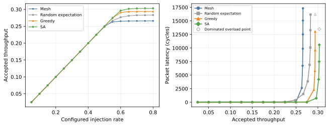

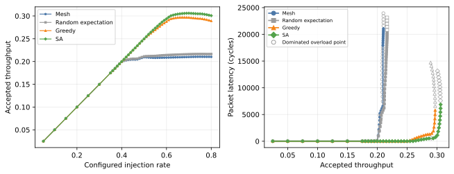

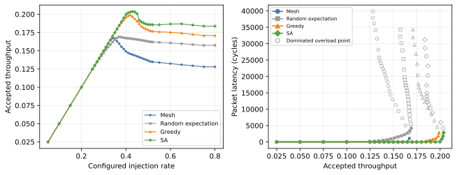

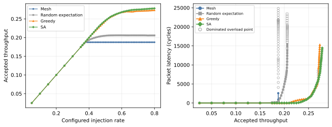

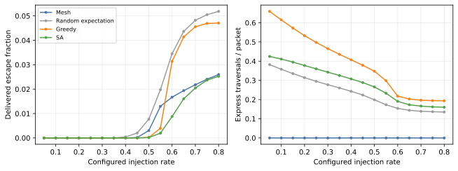

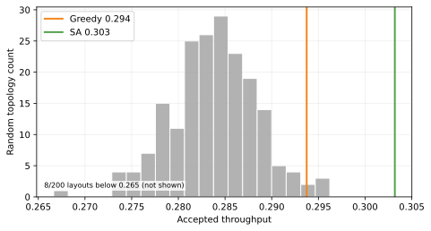

## 1.4 Placement–traffic 全交叉

| placement training | Uniform | Tornado | Bit-complement | CutStress-bidir | Mixture mean |
|---|---|---|---|---|---|
| Uniform | G 1.104 / SA 1.137 | G 1.107 / SA 1.043 | G 1.264 / SA 1.297 | G 1.160 / SA 1.093 | G 1.157 / SA 1.139 |
| Tornado | G 1.033 / SA 1.030 | G 1.416 / SA 1.453 | G 1.274 / SA 1.270 | G 1.289 / SA 1.302 | G 1.245 / SA 1.254 |
| Bit-complement | G 1.121 / SA 0.885 | G 1.020 / SA 1.020 | G 1.331 / SA 1.427 | G 1.072 / SA 1.072 | G 1.130 / SA 1.084 |
| CutStress-bidir | G 1.064 / SA 1.049 | G 1.114 / SA 1.051 | G 1.385 / SA 1.277 | G 1.438 / SA 1.456 | G 1.240 / SA 1.197 |
| Mixture | G 1.077 / SA 1.064 | G 1.156 / SA 1.245 | G 1.334 / SA 1.393 | G 1.222 / SA 1.347 | G 1.194 / SA 1.256 |
| Random expectation | 1.059 | 1.029 | 1.220 | 1.098 | 1.099 |

前五行每格依次给出 Greedy 与 SA；图中颜色只由 SA 数值决定。Random expectation 为单一 baseline。

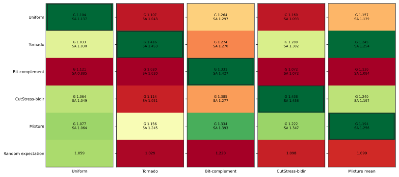

## 2. 次要与解释性数据

所有 raw JSON 已保存 per-source throughput/latency、Jain fairness、directed-link utilization、平均 hops、express/packet、escape fraction，以及 overall/escape/adaptive 三组 log2 latency histogram。当前 standalone 尚未记录某一固定 (s,t) 的逐候选选择次数，因此报告没有伪造该项。

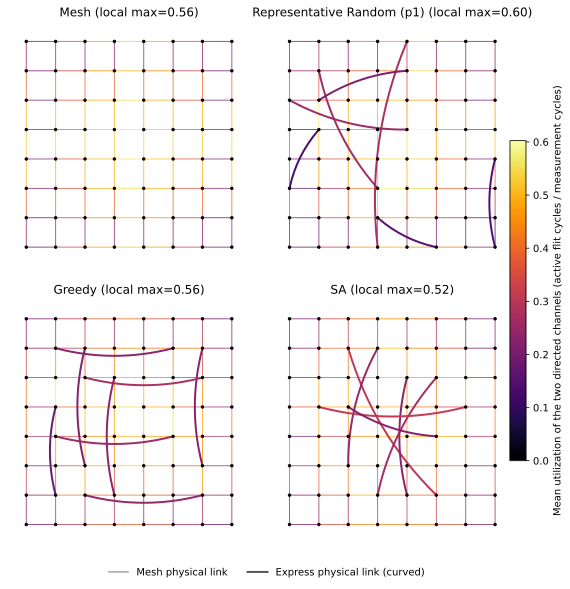

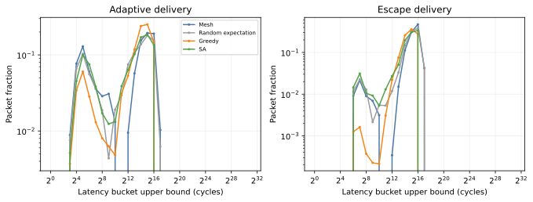

## 3. Ablation

### routing_ablation

| topology_label | configured_injection_rate | throughput | latency | completed | samples |
|---|---|---|---|---|---|
| greedy:express_dijkstra | 0.7000 | 0.2509 | 15514.5759 | 4 | 4 |
| greedy:express_dijkstra | 0.8000 | 0.2492 | 21404.9142 | 4 | 4 |
| greedy:global_dijkstra_oracle | 0.7000 | 0.3055 | 6987.5269 | 4 | 4 |
| greedy:global_dijkstra_oracle | 0.8000 | 0.2725 | 18668.9962 | 4 | 4 |
| greedy:local_mesh_adaptive | 0.7000 | 0.1322 | 34086.2398 | 4 | 4 |
| greedy:local_mesh_adaptive | 0.8000 | 0.1337 | 38053.4424 | 4 | 4 |
| greedy:q_only | 0.7000 | 0.1461 | 30676.2883 | 4 | 4 |
| greedy:q_only | 0.8000 | 0.1480 | 36406.3965 | 4 | 4 |
| greedy:random_top8 | 0.7000 | 0.0727 | 50122.1196 | 4 | 4 |
| greedy:random_top8 | 0.8000 | 0.0729 | 52612.1971 | 4 | 4 |
| greedy:standard | 0.7000 | 0.2937 | 9586.0636 | 4 | 4 |
| greedy:standard | 0.8000 | 0.2937 | 16195.3682 | 4 | 4 |
| greedy:static_shortest | 0.7000 | 0.1491 | 34968.6905 | 4 | 4 |
| greedy:static_shortest | 0.8000 | 0.1478 | 39257.4970 | 4 | 4 |
| sa:express_dijkstra | 0.7000 | 0.2625 | 13164.2930 | 4 | 4 |
| sa:express_dijkstra | 0.8000 | 0.2604 | 19506.2149 | 4 | 4 |
| sa:global_dijkstra_oracle | 0.7000 | 0.3371 | 2122.0232 | 4 | 4 |
| sa:global_dijkstra_oracle | 0.8000 | 0.3331 | 9357.9340 | 4 | 4 |
| sa:local_mesh_adaptive | 0.7000 | 0.1282 | 35181.6685 | 3 | 4 |
| sa:local_mesh_adaptive | 0.8000 | 0.1275 | 40239.2932 | 4 | 4 |
| sa:q_only | 0.7000 | 0.1885 | 24622.8637 | 4 | 4 |
| sa:q_only | 0.8000 | 0.1877 | 28160.7335 | 4 | 4 |
| sa:random_top8 | 0.7000 | 0.0710 | 49542.4011 | 4 | 4 |
| sa:random_top8 | 0.8000 | 0.0711 | 52144.6126 | 4 | 4 |
| sa:standard | 0.7000 | 0.3030 | 7491.0497 | 4 | 4 |
| sa:standard | 0.8000 | 0.3032 | 13493.0806 | 4 | 4 |
| sa:static_shortest | 0.7000 | 0.1410 | 30666.3343 | 4 | 4 |
| sa:static_shortest | 0.8000 | 0.1435 | 35277.4547 | 4 | 4 |

### information_ablation

| topology_label | configured_injection_rate | throughput | latency | completed | samples |
|---|---|---|---|---|---|
| greedy:instant | 0.7000 | 0.2948 | 9366.9282 | 4 | 4 |
| greedy:instant | 0.8000 | 0.2945 | 15901.3902 | 4 | 4 |
| greedy:physical_registered | 0.7000 | 0.2937 | 9586.0636 | 4 | 4 |
| greedy:physical_registered | 0.8000 | 0.2937 | 16195.3682 | 4 | 4 |
| mesh:instant | 0.7000 | 0.2657 | 12516.6955 | 4 | 4 |
| mesh:instant | 0.8000 | 0.2659 | 17326.9802 | 4 | 4 |
| mesh:physical_registered | 0.7000 | 0.2657 | 12516.6955 | 4 | 4 |
| mesh:physical_registered | 0.8000 | 0.2659 | 17326.9802 | 4 | 4 |
| sa:instant | 0.7000 | 0.3057 | 7129.9082 | 4 | 4 |
| sa:instant | 0.8000 | 0.3059 | 13039.0599 | 4 | 4 |
| sa:physical_registered | 0.7000 | 0.3030 | 7491.0497 | 4 | 4 |
| sa:physical_registered | 0.8000 | 0.3032 | 13493.0806 | 4 | 4 |

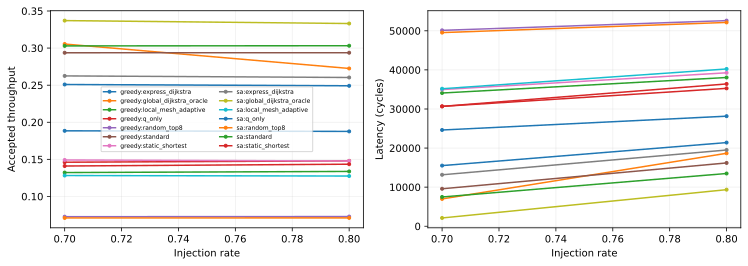

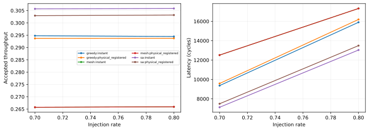

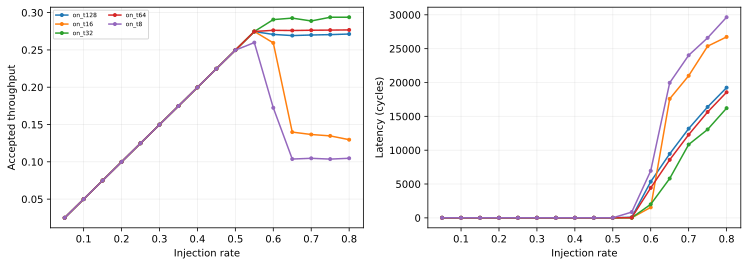

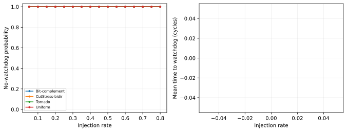

### Escape 数值摘录

| topology_label | configured_injection_rate | throughput | latency | escape | completed | samples |
|---|---|---|---|---|---|---|
| on_t128 | 0.4000 | 0.1998 | 14.7811 | 0.0000 | 20 | 20 |
| on_t128 | 0.7000 | 0.2700 | 13182.3928 | 0.0015 | 20 | 20 |
| on_t128 | 0.8000 | 0.2713 | 19239.5593 | 0.0012 | 20 | 20 |
| on_t16 | 0.4000 | 0.1998 | 14.7810 | 0.0001 | 20 | 20 |
| on_t16 | 0.7000 | 0.1366 | 20994.1196 | 0.2081 | 20 | 20 |
| on_t16 | 0.8000 | 0.1297 | 26736.6110 | 0.2140 | 20 | 20 |
| on_t32 | 0.4000 | 0.1998 | 14.7817 | 0.0000 | 20 | 20 |
| on_t32 | 0.7000 | 0.2888 | 10834.8388 | 0.0479 | 20 | 20 |
| on_t32 | 0.8000 | 0.2938 | 16206.2106 | 0.0471 | 20 | 20 |
| on_t64 | 0.4000 | 0.1998 | 14.7811 | 0.0000 | 20 | 20 |
| on_t64 | 0.7000 | 0.2764 | 12288.0392 | 0.0110 | 20 | 20 |
| on_t64 | 0.8000 | 0.2768 | 18560.3578 | 0.0099 | 20 | 20 |
| on_t8 | 0.4000 | 0.1998 | 14.7681 | 0.0024 | 20 | 20 |
| on_t8 | 0.7000 | 0.1047 | 24017.6781 | 0.2660 | 20 | 20 |
| on_t8 | 0.8000 | 0.1048 | 29643.7724 | 0.2658 | 20 | 20 |

### Escape-off completion 摘录

| traffic | configured_injection_rate | completion_probability | completed | samples |
|---|---|---|---|---|
| Bit-complement | 0.5000 | 1.0000 | 20 | 20 |
| Bit-complement | 0.7000 | 1.0000 | 20 | 20 |
| Bit-complement | 0.8000 | 1.0000 | 20 | 20 |
| CutStress-bidir | 0.5000 | 1.0000 | 20 | 20 |
| CutStress-bidir | 0.7000 | 1.0000 | 20 | 20 |
| CutStress-bidir | 0.8000 | 1.0000 | 20 | 20 |
| Tornado | 0.5000 | 1.0000 | 20 | 20 |
| Tornado | 0.7000 | 1.0000 | 20 | 20 |
| Tornado | 0.8000 | 1.0000 | 20 | 20 |
| Uniform | 0.5000 | 1.0000 | 20 | 20 |
| Uniform | 0.7000 | 1.0000 | 20 | 20 |
| Uniform | 0.8000 | 1.0000 | 20 | 20 |

### Escape deadlock 对照（Uniform Greedy，rate=0.4，2 VC）

| topology_label | global_deadlocks | ni_watchdogs | drain_completed | samples | mean_deadlock_cycle | mean_drain_completion_cycle |
|---|---|---|---|---|---|---|
| off | 20 | 20 | 0 | 20 | 6476.8500 | — |
| on_t32 | 0 | 0 | 20 | 20 | — | 33311.0000 |

原 4-VC Escape-off sweep 没有观察到 global deadlock，只说明在给定负载、seed 和测量窗口中，潜在的 cyclic channel dependency 没有同时被占满，不构成 deadlock-free 证明。2-VC 对照压缩了 adaptive 资源，使该依赖环在 20/20 seeds 中闭合；Escape on 虽然只剩 1 个 adaptive VC，但阻塞包可不可逆地转入专用 XY escape VC，因此 20/20 seeds 都没有 global-no-progress 或 NI watchdog，并在有限注入后完全 drain。

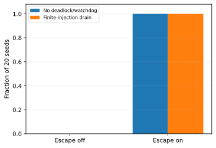

对 Escape-off seed 1 在 global-no-progress cycle 5896 导出了实际的packet/channel wait-for graph；最后一次 flit move 是 cycle 895，当时仍有 311 个 live packets。等待图中存在一个由 20 个 packet 构成的闭合强连通分量：其中每个 packet 请求的两个 output VC 都被该分量内的 packet 占用。下图抽取了其中最短的、包含 express channel 的10-channel simple cycle；两条红边 `19→51` 和 `46→14` 是 express channel，其余为 mesh channel。

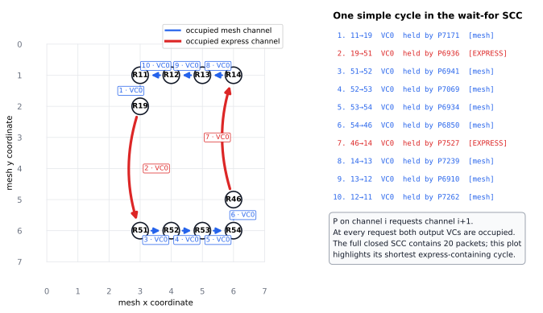

## 4. Scaling

| Name | configured_injection_rate | throughput | latency | hops | max_load | fairness | completed | samples |
|---|---|---|---|---|---|---|---|---|
| 8x8-B32:greedy | 0.8000 | 0.2937 | 16195.3682 | 4.6011 | 0.5959 | 0.9563 | 4 | 4 |
| 8x8-B32:mesh | 0.8000 | 0.2659 | 17326.9802 | 5.0570 | 0.5729 | 0.8840 | 4 | 4 |
| 8x8-B32:random | 0.8000 | 0.2898 | 14359.1194 | 4.5844 | 0.6532 | 0.9118 | 4 | 4 |
| 8x8-B32:sa | 0.8000 | 0.3032 | 13493.0806 | 4.5185 | 0.5963 | 0.9396 | 4 | 4 |
| 8x8-B64:greedy | 0.8000 | 0.3225 | 12166.5629 | 4.2553 | 0.5837 | 0.9767 | 4 | 4 |
| 8x8-B64:mesh | 0.8000 | 0.2659 | 17326.9802 | 5.0570 | 0.5729 | 0.8840 | 4 | 4 |
| 8x8-B64:random | 0.8000 | 0.3086 | 13253.9676 | 4.2939 | 0.6076 | 0.9521 | 4 | 4 |
| 8x8-B64:sa | 0.8000 | 0.3387 | 8906.9676 | 4.1758 | 0.5695 | 0.9709 | 4 | 4 |
| 8x8-B128:greedy | 0.9000 | 0.3961 | 7637.3742 | 3.6855 | 0.5459 | 0.9891 | 4 | 4 |
| 8x8-B128:mesh | 0.9000 | 0.2660 | 21628.0902 | 5.0385 | 0.5893 | 0.8564 | 4 | 4 |
| 8x8-B128:random | 0.9000 | 0.3780 | 8756.0945 | 3.7502 | 0.5777 | 0.9612 | 4 | 4 |
| 8x8-B128:sa | 0.9000 | 0.4012 | 6828.1488 | 3.6649 | 0.5330 | 0.9887 | 4 | 4 |
| 8x8-B32-VC8:greedy | 0.8000 | 0.3996 | 19.1325 | 4.5736 | 0.8094 | 1.0000 | 4 | 4 |
| 8x8-B32-VC8:mesh | 0.8000 | 0.3923 | 1219.6752 | 5.2343 | 0.8022 | 0.9987 | 4 | 4 |
| 8x8-B32-VC8:random | 0.8000 | 0.3918 | 1163.4427 | 4.6974 | 0.8677 | 0.9967 | 4 | 4 |
| 8x8-B32-VC8:sa | 0.8000 | 0.3996 | 19.1325 | 4.5736 | 0.8094 | 1.0000 | 4 | 4 |
| 8x8-B64-L2:greedy | 0.8000 | 0.3110 | 13510.1857 | 4.4388 | 0.5980 | 0.9637 | 4 | 4 |
| 8x8-B64-L2:mesh | 0.8000 | 0.2659 | 17326.9802 | 5.0570 | 0.5729 | 0.8840 | 4 | 4 |
| 8x8-B64-L2:random | 0.8000 | 0.2934 | 15209.8212 | 4.5502 | 0.6120 | 0.9379 | 4 | 4 |
| 8x8-B64-L2:sa | 0.8000 | 0.3156 | 11791.1667 | 4.4062 | 0.5909 | 0.9497 | 4 | 4 |
| 8x8-B64-2flit:greedy | 0.8000 | 0.2194 | 30242.3337 | 4.2054 | 0.8173 | 0.9667 | 4 | 4 |
| 8x8-B64-2flit:mesh | 0.8000 | 0.1824 | 31911.0068 | 5.0209 | 0.8218 | 0.8389 | 4 | 4 |
| 8x8-B64-2flit:random | 0.8000 | 0.2073 | 30898.0570 | 4.2500 | 0.8312 | 0.9295 | 4 | 4 |
| 8x8-B64-2flit:sa | 0.8000 | 0.2334 | 26803.0597 | 4.1064 | 0.8080 | 0.9473 | 4 | 4 |
| 16x16-B256:greedy | 0.4500 | 0.2199 | 771.4003 | 7.5927 | 0.8157 | 0.9886 | 4 | 4 |
| 16x16-B256:mesh | 0.4500 | 0.2104 | 3231.6753 | 10.4640 | 0.8740 | 0.9813 | 4 | 4 |
| 16x16-B256:random | 0.4500 | 0.1596 | 8922.4416 | 8.2437 | 0.8227 | 0.7753 | 20 | 20 |
| 16x16-B256:sa | 0.4500 | 0.2247 | 29.8949 | 7.4961 | 0.8199 | 1.0000 | 4 | 4 |
| 16x16-B256-L4:greedy | 0.4500 | 0.2197 | 461.1526 | 7.6237 | 0.8353 | 0.9837 | 4 | 4 |
| 16x16-B256-L4:mesh | 0.4500 | 0.2104 | 3231.6753 | 10.4640 | 0.8740 | 0.9813 | 4 | 4 |
| 16x16-B256-L4:random | 0.4500 | 0.1918 | 2636.1418 | 8.4196 | 0.8834 | 0.8913 | 20 | 20 |
| 16x16-B256-L4:sa | 0.4500 | 0.2247 | 27.7351 | 7.6149 | 0.8006 | 1.0000 | 4 | 4 |
| 16x16-B256-SoC:greedy | 0.5500 | 0.2191 | 6055.8655 | 5.4610 | 0.8467 | 0.8722 | 4 | 4 |
| 16x16-B256-SoC:mesh | 0.5500 | 0.1751 | 11252.8918 | 6.7104 | 0.8573 | 0.7592 | 4 | 4 |
| 16x16-B256-SoC:random | 0.5500 | 0.1228 | 21392.2916 | 5.8745 | 0.5651 | 0.7337 | 20 | 20 |
| 16x16-B256-SoC:sa | 0.5500 | 0.2466 | 2525.8479 | 5.2716 | 0.7724 | 0.9436 | 4 | 4 |

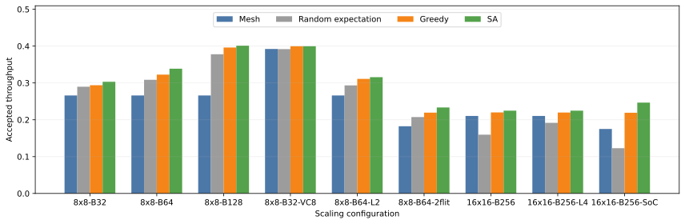

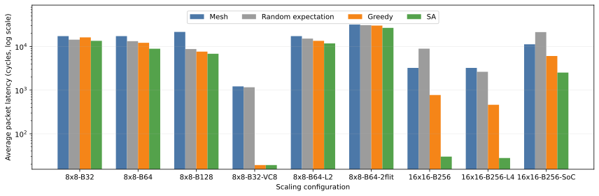

前八组 Uniform 配置中，SA 均匹配或提高 Greedy throughput，说明其优势能够跨 budget、VC、长度相关延迟、两 flit packet 和 16×16 网络保持。SoC 的 R=0.55 近饱和点更苛刻：Mesh/Random 进入长期拥塞；256-cycle local escape timeout 下 ASPL Greedy 保持为稳定的中间点，而按完整配置重搜的 SA 在四个 holdout seed 上进一步提高吞吐、降低延迟，且 Greedy/SA 均无 watchdog。

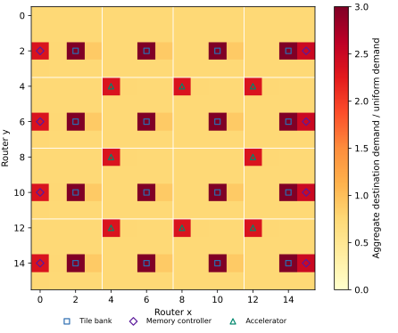

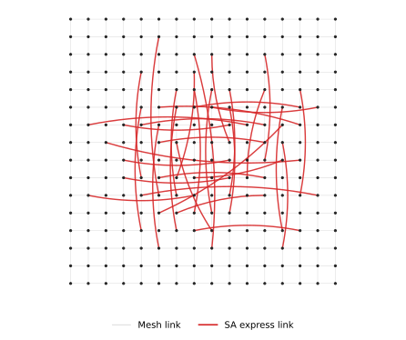

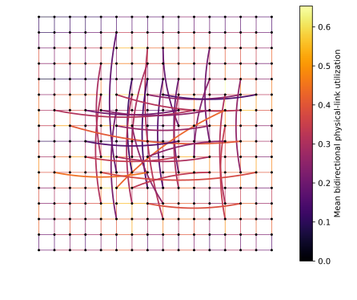

Scaling 配置使用与图横轴一致的语义名称：`8x8-B32` 是完整参考；`8x8-B64`/`8x8-B128` 只改变 wire budget；`8x8-B32-VC8` 只改为 8 VC；`8x8-B64-L2` 使用 B64 与 ceil(wire/2)；`8x8-B64-2flit` 使用 B64、2-flit packet 和 timeout64；`16x16-B256` 同比例扩展尺寸、budget、最短线长、K、VC 和 timeout；`16x16-B256-L4` 再令 express latency=ceil(wire/4)。

`16x16-B256-SoC` 保持 ideal-latency `16x16-B256` 的网络资源和 routing policy，但 traffic 改为 heterogeneous-SoC、rate=0.55，并将纯本地的 escape timeout 从 64 增至 256，以避免正常 adaptive congestion 被过早导入单一 escape VC；ASPL Greedy 和 SA 均针对完整配置重新评估/布线。

16×16 的 B256 来自面积与线性尺寸共同缩放：B32×4 routers×2 wire length；minimum length 3→6、K 8→16、VC 4→8。Random 是 10 个独立 topology×2 traffic seed 的 expectation；`16x16-B256` 固定 rate=0.45 和 admission=1.0，只将 8×8 的 escape timeout=32 按线性尺寸翻倍为 64，K16 和 routing 算法不变。Random 保留为诊断数据，不用于选择该工作点。

每个 scaling 配置的 SA 均按其完整参数独立搜索；8×8 hardware ablation 统一扫 rate=0.05--0.80，两个 16×16 Uniform 配置扫 0.35/0.40/0.45。`16x16-B256-SoC` 的 SA 曲线目标覆盖 0.45/0.50/0.55；该 workload 最热 endpoint 负载为均匀端点均值的 3 倍，对应 configured-rate 硬上限为 2/3。它从原始 traffic-aware ASPL Greedy 初态开始，search 使用 traffic seeds 1/2，扩展 validation 使用 seeds 3/4/9--16，最终表对 Mesh/Greedy/SA 使用此前未查看的连续 holdout seeds 17--20；只调整离散 search-budget 参数，不使用手工 repair 或挑选 final traffic seed。SA 使用预先固定的 placement-search seeds 42--45、每链 4 restarts，并合并比较全部 16 个长测 elite。同一 holdout block 延长到 300k measurement 后，Mesh/Greedy/SA 的 throughput 为 0.1742/0.2168/0.2444，latency 为 26425/14425/7280 cycles，严格排序保持且 Greedy/SA 均无 watchdog；三者均低于 offered=0.275，所以 latency 表示过载积压而非有限稳态队列。两个 length-aware 配置的 ASPL Greedy 也按相应 edge cost 重新布线，不是固定 ideal-latency placement 后只改测量参数。注意：`8x8-B64-2flit` 将 escape timeout 从 32 按两 flit 的序列化比例扩展到 64；当前 packet_flits>1 是 packet-granular serialization 近似，不是逐 flit wormhole；8×8/B64/B128 已改用完整 ASPL Greedy 与统一 SA；16×16 Greedy 使用同一 ASPL 目标的可扩展候选预筛，SA 仍使用相同的 simulation-guided procedure。

## 异常和不符合预期的现象

- 检测到 20 个 global-no-progress 样本。
- 检测到 243 个 NI watchdog 事件（escape=164、escape_deadlock_contrast=20、random_distribution=17、routing_ablation=1、scaling=41）；其中 222 个按配置继续运行到 simulation limit 并纳入统计，21 个提前终止样本不纳入 throughput/latency 均值。
- Random distribution 中 9/200 个 topology 在两个 seed 共触发 17 次 NI starvation watchdog；这些 case 均继续运行到完整 measurement limit，图中的低吞吐长尾不是提前终止值。
- Scaling watchdog 来自 16x16-B256:random_p1, 16x16-B256:random_p10, 16x16-B256:random_p2, 16x16-B256:random_p3, 16x16-B256:random_p4, 16x16-B256:random_p5, 16x16-B256:random_p6, 16x16-B256:random_p8, 16x16-B256:random_p9, 16x16-B256-L4:random_p1, 16x16-B256-L4:random_p10, 16x16-B256-L4:random_p3, 16x16-B256-L4:random_p4, 16x16-B256-L4:random_p5, 16x16-B256-L4:random_p6, 16x16-B256-L4:random_p7, 16x16-B256-L4:random_p9, 16x16-B256-SoC:mesh, 16x16-B256-SoC:random_p1, 16x16-B256-SoC:random_p2, 16x16-B256-SoC:random_p3, 16x16-B256-SoC:random_p4, 16x16-B256-SoC:random_p8, 16x16-B256-SoC:random_p9；这些 case 均按配置继续运行到 simulation limit，未把 watchdog 时刻的瞬时值当作最终结果。
- 16x16-B256-SoC: ASPL Greedy 接受吞吐 0.2191，比 Mesh 的 0.1751 高 25.1%；平均延迟从 11252.9 降到 6055.9（变化 -46.2%）。
- 16x16-B256-SoC 的 Greedy/SA 各四个 holdout seeds 均运行到 simulation limit；NI watchdog 数分别为 0/0，最大 busy streak 为 21657/5241。SA throughput=0.2466，相对 Greedy +12.6%；SA latency=2525.8，相对 Greedy -58.3%。
- 16x16-B256-SoC 的 10 个 Random topology 平均 latency 全部超过 100 cycles；Random expectation 在该非均匀流量下系统性差于 Mesh，并非由少数离群布局单独造成。

## Garnet 一致性状态

旧 V5 instant-info 校准的六组案例满足 throughput <1%、latency <2%。下表合并已有 formal V8、8×8/B=64、rate=0.8 长测和 9-seed B32/Uniform/ASPL/rate=0.7 长测。Garnet 的同周期诊断表明：1 GHz tester / 2 GHz Ruby 下，一半周期的首次 NI query 会在 periodic registration-control event 之前惰性快照 q/r。standalone 改为复现这一交替顺序后，七组 throughput 全部位于 Garnet 的 1.7% 内；四组 latency 在 3% 内，两组仅差 3.04%/3.13%，Tornado Greedy 饱和拐点仍高 12.8%。因此不能把 standalone 主结果直接冒充 Garnet 最终结果。同一 Tornado Greedy 的 200+2k instrumented 短测中，throughput/latency 仅差 -0.41%/-0.88%，observed q/r 均值仅差 -1.03%/+2.68%，说明长测 latency 差异是在饱和拐点累积放大的。候选表逐元素审计覆盖全部 4032 个非本地 source--destination pair，未发现差异；q=r=0 的静态候选隔离实验吞吐/延迟差异仅 0.02%/0.26%，q-only 吞吐也只差 0.18%。因此剩余误差不是 traffic、top-K、链路带宽或基本 VC 时序错误，而是 delayed r 与 q 联合反馈在 Tornado 饱和点进入不同拥塞分支。强制所有 snapshot 提前、提前 credit、以及去掉 tester-to-NI 一周期边界都会使多组校准明显恶化；没有把traffic-specific fudge 写入模型。另已修正 q 诊断曾误报发送队列长度的问题，当前统计与路由一样均报告 occupied adaptive express VCs。

| calibration_set | traffic | topology | sample_count | garnet_throughput | standalone_throughput | throughput_delta_percent | garnet_latency | standalone_latency | latency_delta_percent |
|---|---|---|---|---|---|---|---|---|---|
| v8_b32_rate07 | uniform_random | greedy | 9 | 0.291 | 0.286 | -1.608 | 5800.636 | 6042.166 | 4.164 |
| v8_b64_rate08 | tornado | greedy | 3 | 0.368 | 0.366 | -0.740 | 3769.409 | 4250.667 | 12.767 |
| v8_b64_rate08 | tornado | mesh | 3 | 0.212 | 0.210 | -0.656 | 23719.465 | 23922.801 | 0.857 |
| v8_b64_rate08 | tornado | sa | 3 | 0.367 | 0.366 | -0.293 | 4279.385 | 4409.278 | 3.035 |
| v8_b64_rate08 | uniform_random | greedy | 3 | 0.323 | 0.322 | -0.330 | 12234.739 | 12252.799 | 0.148 |
| v8_b64_rate08 | uniform_random | mesh | 3 | 0.266 | 0.266 | 0.007 | 17885.940 | 17325.518 | -3.133 |
| v8_b64_rate08 | uniform_random | sa | 3 | 0.331 | 0.329 | -0.485 | 10569.708 | 10544.159 | -0.242 |
